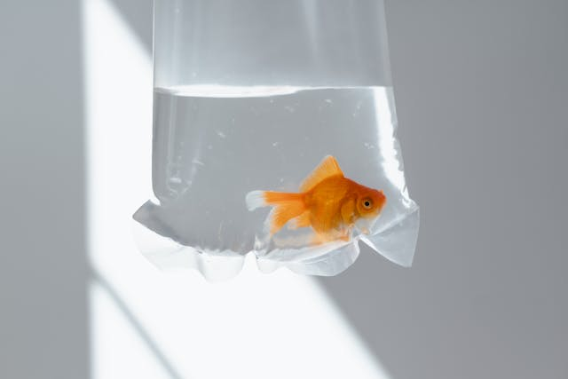

# MLatNLCS2024

A simple adversarial attack example.

We'll take this [image of a goldfish](https://www.pexels.com/photo/a-goldfish-in-a-plastic-bag-8434694/) and try to modify it slightly to trick the model into thinking it's something else:

